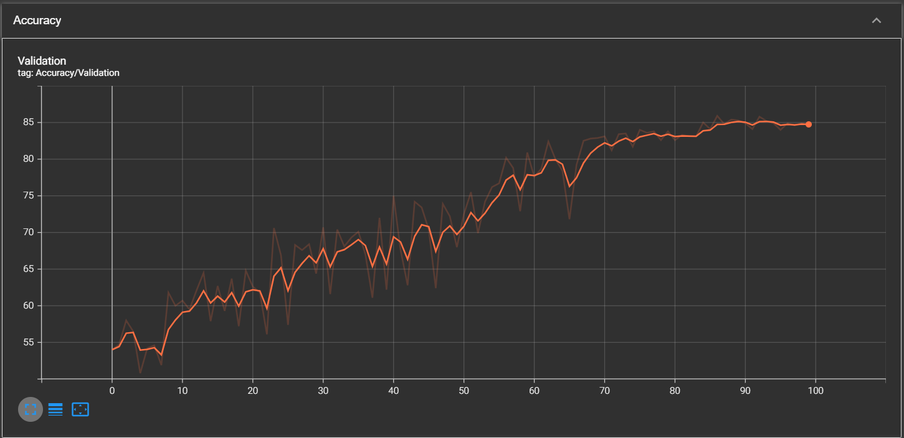

# 🧠 CNN Project – Implementación de ResNet-34 con PyTorch y Modal

Este proyecto implementa y entrena una **Red Neuronal Convolucional (CNN)** del tipo **ResNet-34**, para clasificar imagenes entre Gatos y Perros. Desarrollado en **Python** con **PyTorch**.  
El trabajo se divide en una parte teórica (documento PDF) y una parte práctica (código).  

El objetivo principal es entrenar y desplegar un modelo de clasificación de imágenes utilizando **recursos en la nube (Modal)** para aprovechar GPUs, y posteriormente realizar inferencia tanto en la nube como en local con herramientas de visualización.

---

## 📚 Estructura del proyecto

| Archivo / Carpeta | Descripción |
|--------------------|-------------|
| **CNNProject.pdf** | Documento teórico introductorio. Explica los fundamentos de las CNN y la arquitectura ResNet-34. |
| **model.py** | Implementación de la arquitectura **ResNet-34** en PyTorch. Define las capas, bloques residuales y estructura del modelo. |
| **train.py** | Script de **entrenamiento** del modelo en la nube utilizando **Modal** (permite usar GPU). Incluye configuración de TensorBoard para el seguimiento de métricas. |
| **main.py** | Código de **inferencia remota**. Conecta con la API de Modal para recuperar el modelo entrenado y realizar predicciones desde la nube. |
| **local_inference.py** | Alternativa de inferencia **local**. Carga el modelo entrenado (`best_model.pth`) y genera una **visualización** del procesamiento en las primeras capas convolucionales. |
| **best_model.pth** | Nombre del archivo donde se guardarán los pesos del modelo entrenado (se deberá recuperar desde el modal volume creado) . |
| **perrete.webp** | Imagen de ejemplo utilizada para realizar pruebas de inferencia local. |
| **requirements.txt** | Lista de dependencias necesarias para ejecutar el proyecto. |

---

## ⚙️ Herramientas y Tecnologías utilizadas

- **Python 3.10+**
- **PyTorch** → Framework de deep learning para implementar la ResNet-34.
- **Modal** → Plataforma de computación en la nube para ejecutar código con acceso a GPU.
- **TensorBoard** → Monitoreo del proceso de entrenamiento (loss, accuracy, etc.).
- **Matplotlib / NumPy / PIL** → Procesamiento y visualización de imágenes.

---

## 🚀 Flujo general del proyecto

1. **Diseño teórico:**  
   Se elabora el documento `CNNProject.pdf` con una explicación sobre las CNN y la arquitectura ResNet.

2. **Implementación del modelo:**  
   El archivo `model.py` define la arquitectura ResNet-34 en PyTorch.

3. **Entrenamiento en la nube:**  
   En `train.py`, el entrenamiento se ejecuta en Modal, aprovechando GPUs.  
   Durante este proceso, se generan métricas registradas en **TensorBoard**.

4. **Inferencia:**
   - **Remota:** `main.py` obtiene el modelo desde la nube a través de modal y recupera la predicción.  
   - **Local:** `local_inference.py` utiliza el archivo `best_model.pth` para hacer inferencia en local y visualizar las activaciones intermedias.

---

## 📊 Resultados 

- El modelo termina con una accuracy del 85.90%

  

## 🖼️ Referencias

Este projecto forma parte de mi primer acercamiento hacia el mundo de la visión computacional y no podria haber sido posible sin el material que presentaré a continuación:

1. **Estudio Teórico:**
  - [A Survey of Convolutional Neural Networks:
Analysis, Applications, and Prospects](https://arxiv.org/pdf/2004.02806)
- [Deep Residual Learning for Image Recognition](https://arxiv.org/pdf/1512.03385)

2. **Implementación Práctica:**
   - [Andreas Trolle, Audio CNN](https://github.com/Andreaswt/audio-cnn/tree/main):
     Todo el projecto esta fuertemente basado en este repositorio donde el autor hace una exposición brillante de como aterrizar todos estos conceptos y crear y entrenar un modelo: 
   - [ResNet-PyTorch](https://github.com/JayPatwardhan/ResNet-PyTorch/tree/master):
     Codigo para una ResNet de clasificacion con CIFAR10
   - [Base de Datos](https://github.com/RizwanMunawar/Cats-vs-dogs-classification-computer-vision-/tree/master):
     El entrenamiento se lleva a cabo siguiendo los datos extraidos de este repositorio.

